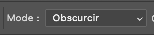
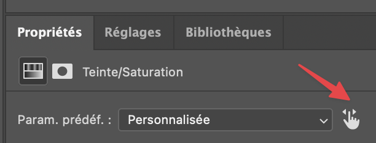
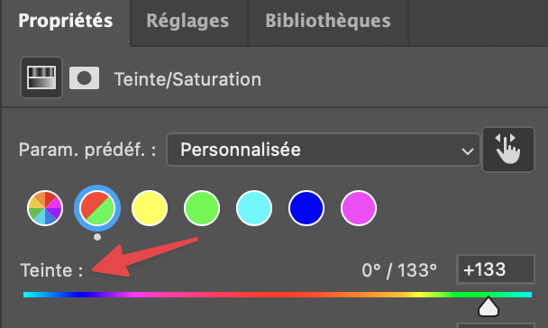
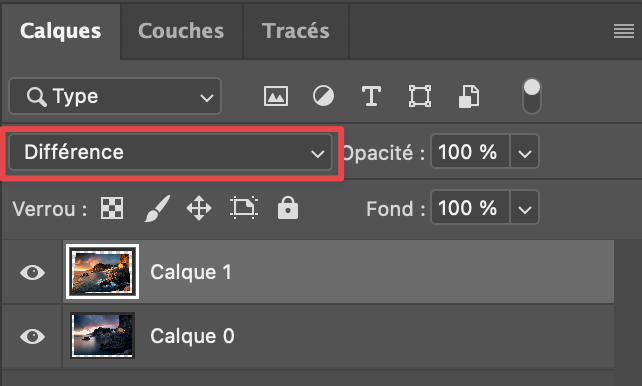
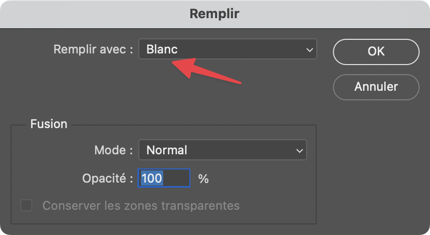

## 📑 Sommaire

- [1. Effacer un liseré](#1-effacer-un-liseré) 
- [2. Mettre des photos dans des cadres muraux](#2-mettre-des-photos-dans-des-cadres-muraux)
- [3. Changer une teinte](#3-changer-une-teinte)
- [4. Combiner 2 photos pour récupérer certaines zones](#4-combiner-2-photos-pour-récupérer-certaines-zones)

>[!NOTE]
>Réalisé avec Photoshop 27.10.0

## 1. Effacer un liseré

>[!IMPORTANT]
>À partir du fichier "Reflet lac liseré blanc.dng"

1. Utiliser l'outil Tampon duplicateur
2. Choisir le Mode : Obscurcir  
   
3. Touche option sur macOS (ou Alt sur Windows) + clic sur le ciel
4. Puis passer le tampon sur le liseré

## 2. Mettre des photos dans des cadres muraux

>[!IMPORTANT]
>À partir des fichiers :
>- Copie de Cadres au mur.jpg
>- Copie de Terres perdues.jpg
>- Copie de Altitudes.jpg

1. Ouvrir les 3 fichiers
2. Depuis Terres perdues ou Altitudes : faire Maj + clic calque + déplacer vers Copie Cadres au mur
3. Sélectionner le calque Terres perdues et utiliser l'outil Transformation (cmd + T sur macOS ou ctrl + T sur Windows) puis touche fn sur macOS (ou Shift sur Windows) + redimensionner pour garder les proportions
4. Puis clic droit et choisir Distorsion et ajuster au cadre

Pour créer un masque par rapport à l'intérieur d'un cadre :
1. Utiliser la Baguette Magique avec ces paramètres :  

2. Sélectionner la zone blanche sur le calque
3. Revenir sur le calque de l'image à intégrer
4. Créer un masque de fusion
5. Enlever le cadenas entre le calque et le masque
6. Outil transformation et redimensionner l'image

## 3. Changer une teinte

>[!IMPORTANT]
>À partir de l'image Voiture-rouge.jpg

1. Créer un calque de réglage Teinte / Saturation
2. Avec la petite main, sélectionner la couleur avec la pipette  

3. Puis faire varier le curseur de la teinte :  

4. Au besoin, peindre en noir sur les zones où la teinte a été changée à tort

## 4. Combiner 2 photos pour récupérer certaines zones

>[!IMPORTANT]
>À partir des fichiers : Ponta-do-Sol-Sunset.jpg et _DL_4788-Modifier.jpg

1. Ouvrir les 2 images dans Photoshop
2. Copier une image vers l'autre (Shift + clic calque et déplacer vers l'autre image)
3. Sélectionner les 2 calques puis Édition > Alignement automatique des calques
4. Sur le calque du dessus, choisir le Mode de fusion Différence :  

5. Utiliser l'outil Déplacement sur le calque du dessus pour affiner l'alignement
6. Mettre le calque le plus jaune dessus
7. Créer un masque noir (opt sur macOS ou alt sur Windows + clic sur nouveau masque) sur ce calque du dessus
8. Utiliser l'outil Lasso Polygonal pour créer un contour sur le chapiteau
9. Se mettre sur le masque, Menu Édition > Remplir, puis :  

10. Remettre le mode de fusion du calque du dessus à Normal
11. Créer un calque de réglage Courbes
12. Passer en mode Écrétage :  

13. Régler les bleus et les rouges
